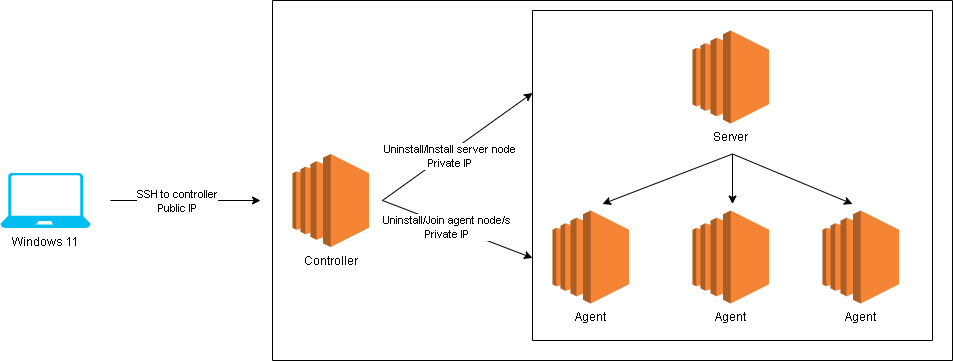

# Automating a K3s cluster w/ K3sup

## Why?

I was getting tired of whenever changing networks, that all of my devices/nodes would get different ips. This would require a complete uninstall of k3s from every server & agent node and then a re-install with the new appropriate IPs. I got annoyed having to ssh in and out of everywhere, so I did this.

## Architecture

Currently this works and has been tested with the following setup:
- OS - Windows 11
- Powershell 7
- 1 controller
  - the controller will not become a node in the k3s cluster, rather it will be from where we control/coordinate the cluster
- 1 server node
  - this is the server/manager/master node
- numerous agents
  - all agents that will join the server/manager/master node to form the cluster

## Pre-Requisites
1. SSH access is required from wherever you are running powershell to the controller
   - I personally didn't have great luck with k3sup from Windows, and because I knew it worked so smoothly in Linux, I decided to keep my controller Linux
2. SSH access is required from the **controller** node to every server & agent node
   - This is a pre-requisite of k3sup
3. Install k3sup on your controller
   - [K3SUP](https://github.com/alexellis/k3sup) - go here to learn how to do this
4. Install kubectl on your controller
   - Installing k3sup did not install kubectl for me, so I had to do this manually
   - [install kubectl](https://kubernetes.io/docs/tasks/tools/install-kubectl-linux/)

**Tip**: *I highly recommend using a [cloud-init](https://cloudinit.readthedocs.io/en/latest/index.html) file when launching your instances. I have 2 separate files. One for the controller where I have my laptop's public ssh key, as well as all the commands for installing k3sup & kubectl. I use another cloud-init file for my server & agents that just has the controller's ssh key.*

## How to Run
1. Make sure the pre-reqs are satisfied
2. Create a config file that represents your architecture
   - As mentioned above, currently this only works with 1 controller & 1 server, but multiple agents should be fine
   - Use the **config/config_template.json** file as an example
3. Run `.\reset-k3sup.ps1 .\config\my_config_file.json` (replace with your json file)

## What Happens?
1. Ingests your config file
2. Tests that ssh port 22 is open to the controller. Errors and exits on any failures.
3. Uninstalls k3s on agents and server via a double ssh.
   - the uninstall commands are created from powershell, then sent to controller via public ip ssh, which forwards them to the server/agents via private ip ssh
   - k3sup conveniently has respective uninstall scripts for this
   - if the script doesn't exist, it will inform of the file not available, then move on to the next node
4. Installs k3s on the server node from the controller using the `k3sup install` command
   - Due to some proxy & network issues using, there are `--k3s-extra-args` I use here to force the internal and external ip of the server node
   - This was the solution I found that lead me to this: [K3s issue #1267](https://github.com/k3s-io/k3s/issues/1267)
5. Joins each agent node to the server node from the controller using the `k3sup join` command

## What Next?
1. Login to your controller node
2. Create your *KUBECONFIG* environment variable
3. Run `kubectl get node -o wide` and see your cluster